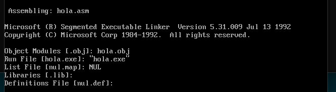
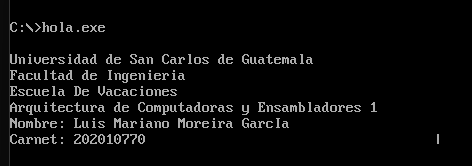
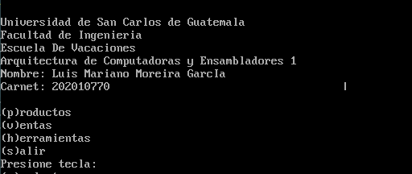
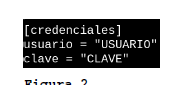
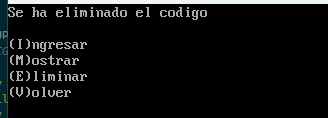
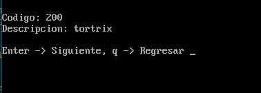
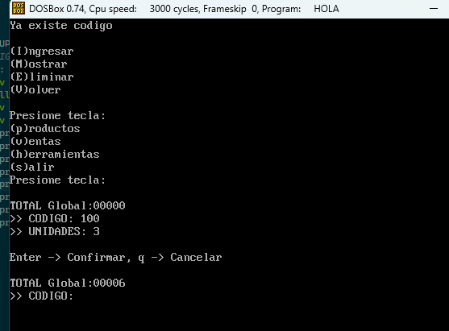
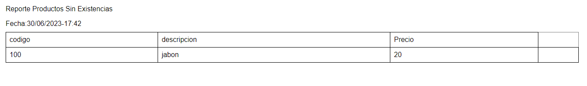
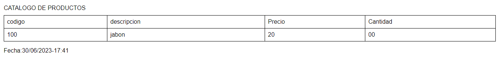
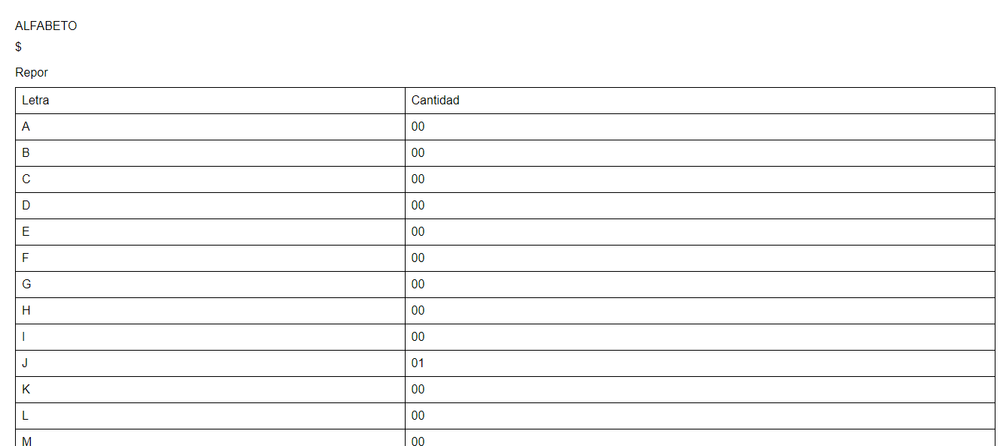

# MANUAL DE USUARIO

## DESCRIPCIÓN DEL PROGRAMA

Un programa capaz de controlar los modulos de productos, ventas y a partir de estos se genera reportes acerca del abecedario, unidades sin existencia o simplemente ver el catalogo.

## USO DEL Programa

### Disposición de los botones
Para hacer uso del programa necesita contar con DOS-BOX version 0.74, a continuación se le describirá como generar este archivo  

### Inicio del programa

Al iniciar el programa tendremos un mensaje de bienvenida: 

### Autenticación

Si las creedenciales son correctas aparecerá el menu principal: 

Formato:

### Módulo de productos
Al presionar la tecla "p" en el menú principal, se accederá al menú del módulo de productos. Aquí se podrán realizar diversas acciones, como agregar nuevos productos, modificar existentes o eliminarlos. 

Si ingresamos i, veremos el siguiente seleccion:  

Si ingresamos m, aparecerá el siguiente menu: 

Tambien podremos eliminar:

### Módulo de ventas
En ventas podremos hacer lo siguiente:  
Ingresamos el codigo e ingresamos las unidades, podremos ver en la imagen superior como se realiza esto, por ultimo tenemos los reportes  
### Reportes
Sin existencias:

Con existencias:

Abecedario:

